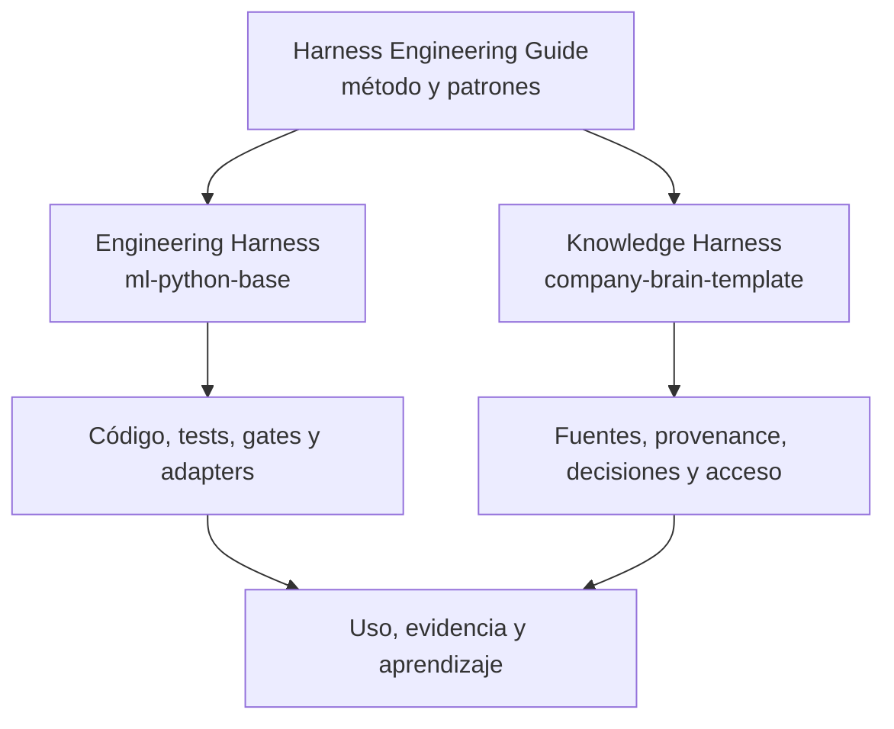
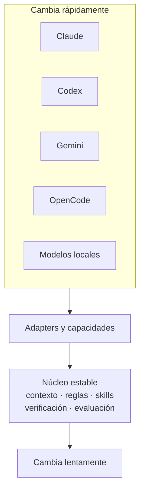

# Engineering Harness y Knowledge Harness

!!! info "Sobre esta página"
    **Qué vas a aprender:** cómo se relacionan las aplicaciones de Harness Engineering para software y conocimiento.

    **Para quién:** developers, tech leads, managers, AI champions y knowledge workers.

    **Leela cuando:** necesites decidir si tu próximo problema trata principalmente de ejecución, contexto o ambos.

Harness Engineering es la metodología. Engineering Harness y Knowledge Harness son dos aplicaciones de la misma idea durable: hacer explícito, asignado, verificable y mejorable el contexto y el feedback que rodean a la IA.

## Qué estabiliza cada uno

| | Engineering Harness | Knowledge Harness |
| --- | --- | --- |
| Pregunta principal | ¿Cómo ejecutar y verificar el trabajo de software? | ¿Qué contexto pueden confiar personas y agentes? |
| Núcleo estable | Reglas, skills, herramientas, workflows, verificación y gates de calidad | Fuentes, provenance, decisiones, ownership, acceso y mantenimiento |
| Implementación de referencia | `ml-python-base` | `company-brain-template` |
| Evidencia habitual | Tests, CI, review, checks de arquitectura y regresiones | Historial de fuentes, registros de decisiones, freshness, acceso y provenance |
| Usuarios principales | Developers, tech leads y equipos de ingeniería | Managers, equipos, roles y knowledge workers |

Pueden compartir conectores, retrieval, skills, reglas, seguridad y prácticas de evaluación. No deberían combinarse por defecto en un único producto o repositorio.

## El núcleo estable y el borde cambiante

No estandarizamos el proveedor. Estandarizamos el ciclo. Por eso la guía sigue siendo útil aunque cambien las herramientas, los modelos, los frameworks, los servidores MCP y los runtimes.

!!! note "Nivel de afirmación"
    La distinción anterior es una recomendación de la guía. Los nombres y capacidades de los repositorios son hechos de las implementaciones de referencia, descritos en el [ecosistema](../reference-implementation/index.md).
