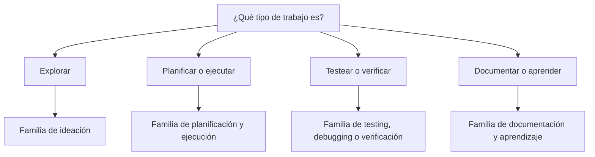

# Skills por intención

!!! info "Sobre esta página"
    **Qué vas a aprender:** cómo elegir una familia de skills sin memorizar una lista larga de entrypoints.

    **Para quién:** developers, tech leads, AI champions y Harness Engineers.

    **Leela cuando:** estés incorporando skills a un workflow o decidiendo qué guía debería ser reutilizable.

`ml-python-base` expone actualmente skills curadas desde `.github/skills/` y skills externas opcionales. Su manifest generado es el inventario operativo. El repositorio todavía no publica un campo formal de familias, por eso esta guía usa agrupaciones por intención como ayuda de navegación, no como una segunda taxonomía de runtime.

## Familias del conjunto de referencia actual

| Intención | Trabajo habitual | Ejemplos actuales |
| --- | --- | --- |
| Bootstrap | Iniciar o adoptar un workspace gobernado | `bootstrap_project`, `bootstrap_company_brain` |
| Ideación | Explorar un problema antes de comprometer una solución | `brainstorm_quick` |
| Planificación y ejecución | Convertir una intención en una implementación accionable | `generate_migration_plan`, `plan_and_execute_feature` |
| Arquitectura y diseño | Definir límites y contratos reutilizables | `create_domain_contract`, `refactor_to_clean_architecture`, `create_mle_agent_package` |
| Testing y debugging | Encontrar fallos y crear verificaciones ejecutables | `generate_e2e_tests`, `systematic_debugging` |
| Verificación | Revisar estructura de módulos y resultados finales | `validate_module_structure`, `verify_changes` |
| Documentación y aprendizaje | Explicar un cambio y conservar la lección | `generate_implementation_docs`, `retrospective` |
| Research | Revisar información que puede haber cambiado | `research_current_info` |

Las skills externas sirven cuando un dominio las necesita, pero no deberían convertirse silenciosamente en una nueva fuente de verdad. Registrá su origen, revisá sus instrucciones y mantené reproducible la proyección gobernada.

## Elegí por trabajo, no por nombre

La skill debería facilitar un procedimiento repetible. No debería reemplazar el criterio, ocultar los acceptance criteria ni convertir toda tarea pequeña en una ceremonia. Para los detalles de implementación, consultá la [referencia de skills de ml-python-base](../reference-implementation/ml-python-base/skills.md).

!!! note "Alineación del catálogo"
    Cuando `ml-python-base` publique un catálogo generado de familias, esta página debería consumirlo. Hasta entonces, los nombres anteriores se derivan de los archivos curados actuales y se mantienen intencionalmente en el nivel de familia.
