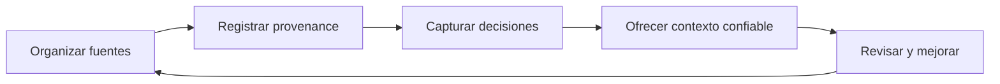

# Trabajo de conocimiento

!!! info "Sobre esta página"
    **Qué vas a aprender:** cómo aplicar ideas de harness a conocimiento compartido y personal.

    **Para quién:** managers, PMs, AI champions, knowledge workers y equipos que necesitan contexto confiable.

    **Leela cuando:** quieras aprovechar contexto estructurado sin empezar por una configuración de developer.

El trabajo de conocimiento tiene el mismo problema básico que el software: el contexto útil está disperso, cuesta encontrar las decisiones y los aprendizajes desaparecen después de una conversación. Un Knowledge Harness hace explícitos las fuentes, la provenance, el ownership, el acceso y el mantenimiento.

No necesitás clonar un repositorio, instalar Python ni ejecutar Docker para adoptar el concepto. Hay una implementación de referencia para los equipos que necesiten operar el sistema.

## Un camino práctico

Empezá por una pregunta que aparezca con frecuencia. Identificá las fuentes autoritativas, registrá por qué son confiables y definí quién mantiene cada una. Agregá retrieval o conexiones con agentes cuando el flujo básico de conocimiento ya esté claro.

## Elegí el alcance

| Alcance | Qué contiene | Ownership |
| --- | --- | --- |
| Company Brain | Conocimiento organizacional compartido, decisiones y contexto operativo | Organización |
| Team o Role Brain | Contexto necesario para un equipo o función | Equipo o rol |
| Second Brain | Notas, proyectos, preferencias, fuentes y aprendizajes | Individuo |

Son alcances de conocimiento, no una obligación de crear cuatro repositorios. Pueden compartir búsqueda, provenance, conectores, skills, reglas y seguridad, mientras mantienen distintas fuentes, permissions, retention, ownership y personalización.

Continuá con [Company Brain, Role Brain y Second Brain](../understand/company-role-second-brain.md).

!!! warning "Mantené límites explícitos"
    El conocimiento organizacional compartido, el conocimiento personal privado, la telemetría operacional y la gestión de performance son cosas distintas. No asumas que las notas personales o la telemetría individual deban compartirse con la organización.
